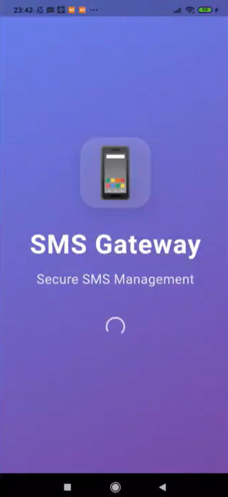
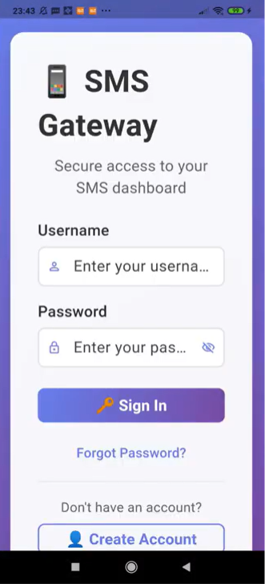
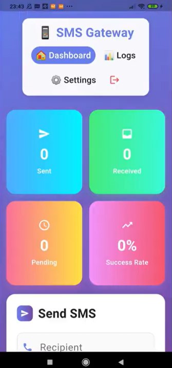
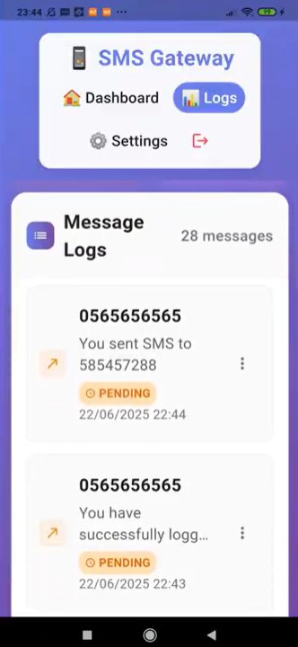
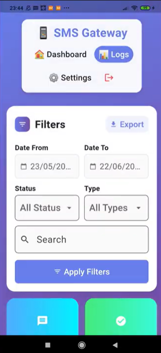

# 📱 Mobile App – Smart SMS Gateway

This Flutter-based mobile application is part of a full-stack system designed to bridge applications (web, mobile, or embedded) with GSM networks. It communicates with a RESTful API to send and receive SMS messages through a secure and intuitive interface.

> This project was developed as part of a **4th-year group project** at the **Higher National School of Computer Science (ESI Algiers)**, within the **Intelligent and Communicant Systems** module — a course focused on IoT, embedded systems, and smart communication technologies.

---

## Features

- 📤 Send SMS messages via a user-friendly form  
- 📥 Receive and display incoming SMS in real time  
- 🔐 Token-based authentication (API key or PIN code)  
- 📄 View logs of sent and received messages  
- 🔄 Communicates with a microcontroller-based gateway via REST API

---

## Technologies Used

- **Language:** Dart  
- **Framework:** Flutter  
- **Communication:** HTTP REST API

---

## Screenshots

#### 🟢 Landing Page  


#### 🔐 Login Screen  


#### 📋 Dashboard  


#### 📑 Logs List  


#### 🔍 Logs Filter  


---

##  Usage

```bash
git clone https://github.com/ics-projet/Mobile_app.git
cd Mobile_app
flutter pub get
flutter run
```


## Related Repositories

This mobile application is part of a complete system hosted in the [ics-projet GitHub organization](https://github.com/ics-projet), which includes:

- 🔌 **ESP Server** – Firmware for the ESP32 gateway module *(C++)*
- 🖥️ **Web App** – HTML/CSS/JS interface for SMS gateway control
- 🌐 **Backend-Sci** – REST API backend built with Python
- 📦 **sms_gateway_sdk_python** – Python SDK for developers
- 📦 **sms_gateway_sdk_js** – JavaScript SDK for integration

> 🔒 Some repositories are private and maintained within the organization.


